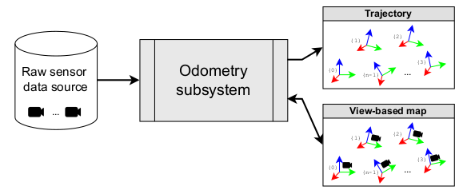

.. _building-maps:

======================
Tutorial: build a map
======================

This tutorial describes the steps for building metric maps using MOLA.

____________________________________________

.. contents::
   :depth: 1
   :local:
   :backlinks: none

____________________________________________

|

1. Prepare the input data
---------------------------------
- Think what sensors do you want to use:

  - At least, one **2D or 3D LiDAR**. It is possible to have multiple LiDARs.
  - Optional: Encoder-based odometry, for wheeled robots.
  - Optional: Low-cost GNSS (GPS) receiver, for georeferencing the final metric maps. 
    You can use `mrpt_sensor_gnss_nmea <https://github.com/mrpt-ros-pkg/mrpt_sensors?tab=readme-ov-file#mrpt_sensor_gnss_nmea>`_ for 
    standard GNSS USB devices providing NMEA messages.

- Decide whether SLAM will run **online** (live) or **offline** (in postprocessing).

- If running **offline** (**recommended**): Grab the data using `ros2 bag record <https://docs.ros.org/en/foxy/Tutorials/Beginner-CLI-Tools/Recording-And-Playing-Back-Data/Recording-And-Playing-Back-Data.html>`_
  if you use ROS 2. Alternative options include using :ref:`MOLA-based dataset sources <supported_sensors>`.

- If using ROS 2...

  - ...and you only have **one LiDAR** as the **unique sensor**,
    then setting up `ROS tf frames <https://www.google.com/search?q=ROS+tf+frames+tutorials>`_
    is not mandatory, if you are happy with tracking the **sensor** pose (vs the vehicle pose).

  - ...and you have wheels odometry or additional sensors on the robot, then having correct ``/tf`` messages
    published is important to let the mapping algorithm know what is the **relative pose of the sensor** within
    the vehicle.
    
- Even if having only one single LiDAR, correctly defining the sensor pose on the vehicle is important
  for correctly tracking the *vehicle pose* instead of the *sensor pose*. This can be done by either...

    - correctly setting up ``/tf``, or
    - using the MOLA-LO applications :ref:`flag <mola_lo_gui_rosbag2>` to manually set the sensor pose on the vehicle without ``/tf``.

|

2. Run MOLA-LO
---------------------------------
The output of running LiDAR odometry on your dataset is a 
an estimated trajectory and a **simple-map** (here is the main stuff to build maps from):

   Role of an "odometry" module (Figure adapted from :cite:`blanco2025mola_lo`).

To process an **offline dataset**, use any of the available options in :ref:`MOLA-LO applications <_launching_mola_lo>`:

- :ref:`mola-lo-gui-rosbag2 <mola_lo_gui_rosbag2>` for a version with GUI, or
- :ref:`mola-lidar-odometry-cli <mola_lidar_odometry_cli>` for a terminal (CLI) version.

To **launch SLAM live** on a robot, read :ref:`how to launch the MOLA-LO ROS 2 node <mola_lo_ros>`.

In any case, make sure to enable the option of **generating and saving the output simple-map** and
take note of where is the generated file. This can be done via environment variables before launching MOLA-LO,
or from the :ref:`UI controls <mola_lo_gui_common_parts>` in the ``mola_lidar_odometry`` subwindow.

.. dropdown:: Use these commands to get going
  :open:

    For quickly getting MOLA-LO running, **you can start using these commands**, although it is recommended
    to later go through the documentation linked above to learn about all the possibilities:

    .. tab-set::

        .. tab-item:: From a rosbag2 (GUI)
          :selected:

            .. code-block:: bash

                MOLA_LIDAR_TOPIC=/ouster/points \
                MOLA_GENERATE_SIMPLEMAP=true \
                MOLA_SIMPLEMAP_OUTPUT=myMap.simplemap \
                MOLA_SIMPLEMAP_GENERATE_LAZY_LOAD=true \
                  mola-lo-gui-rosbag2 /path/to/your/dataset.mcap

            .. note::
                Remember changing ``MOLA_LIDAR_TOPIC`` to your actual raw (unfiltered) LiDAR topic (``sensor_msgs/PointCloud2``).

        .. tab-item:: From a rosbag2 (CLI)

            .. code-block:: bash

                MOLA_SIMPLEMAP_GENERATE_LAZY_LOAD=true \
                mola-lidar-odometry-cli \
                  -c $(ros2 pkg prefix mola_lidar_odometry)/share/mola_lidar_odometry/pipelines/lidar3d-default.yaml \
                  --input-rosbag2 /path/to/your/dataset.mcap \
                  --lidar-sensor-label /ouster/points \
                  --output-tum-path trajectory.tum \
                  --output-simplemap myMap.simplemap

            .. note::
                Remember changing ``--lidar-sensor-label /ouster/points`` to your actual raw (unfiltered) LiDAR topic (``sensor_msgs/PointCloud2``).

        .. tab-item:: From a rosbag2 (CLI) (Large datasets)

            For maps large enough such as the final `.simplemap` does not fit in RAM, you can enable
            lazy-load simplemap generation in the CLI with:

            .. code-block:: bash

                MOLA_GENERATE_SIMPLEMAP=true \
                MOLA_SIMPLEMAP_GENERATE_LAZY_LOAD=true \
                MOLA_SIMPLEMAP_OUTPUT=myMap.simplemap \
                mola-lidar-odometry-cli \
                  -c $(ros2 pkg prefix mola_lidar_odometry)/share/mola_lidar_odometry/pipelines/lidar3d-default.yaml \
                  --input-rosbag2 /path/to/your/dataset.mcap \
                  --lidar-sensor-label /ouster/points \
                  --output-tum-path trajectory.tum

            .. note::
                Remember changing ``--lidar-sensor-label /ouster/points`` to your actual raw (unfiltered) LiDAR topic (``sensor_msgs/PointCloud2``).

.. dropdown:: Building 2D maps

    Until ``mola_2d_mapper`` is released, you can also use the generic LiDAR odometry module to 
    build 2D maps from range finder (2D scanners).

    Just set the ``PIPELINE_YAML`` environment variable pointing to the 2D mapping pipeline (`lidar2d.yaml <https://github.com/MOLAorg/mola_lidar_odometry/blob/develop/pipelines/lidar2d.yaml>`_)
    shipped with the ``mola_lidar_odometry`` package:

    .. code-block:: bash

        MOLA_LIDAR_TOPIC=/scan1 \
        PIPELINE_YAML=$(ros2 pkg prefix mola_lidar_odometry)/share/mola_lidar_odometry/pipelines/lidar2d.yaml \
        MOLA_GENERATE_SIMPLEMAP=true \
        MOLA_SIMPLEMAP_OUTPUT=myMap.simplemap \
          mola-lo-gui-rosbag2 /path/to/your/dataset.mcap

    Remember to change ``/scan1`` to your actual topic name of type ``sensor_msgs/LaserScan``.

.. hint::

    To help you getting familiar with the whole process, feel free of **downloading any of these example simple-maps**
    so you can use follow the rest of the tutorial before building your own maps:
    
    - `mvsim-warehouse01.simplemap <https://molaorg.github.io/mola_test_datasets/datasets/simplemaps/mvsim-warehouse01.simplemap>`_ : 
      A map of a (simulated) warehouse, built from a wheeled robot with a 3D LiDAR.

|

.. _building-maps_sect_inspect_sm:

3. Inspect the resulting simple-map
----------------------------------------
To verify that the generated simple-map is correct, you can use :ref:`sm-cli <app_sm-cli>`.

.. dropdown:: Examples
  :open:

    These examples assume you have downloaded `mvsim-warehouse01.simplemap <https://molaorg.github.io/mola_test_datasets/datasets/simplemaps/mvsim-warehouse01.simplemap>`_,
    but can be also applied, of course, to your own maps:

    .. tab-set::

        .. tab-item:: Basic information

            .. code-block:: bash

                sm-cli info mvsim-warehouse01.simplemap

            Output:

            .. code-block:: yaml

                Loading: 'mvsim-warehouse01.simplemap' of 46.77 MB...

                size_bytes:           46771378
                keyframe_count:       77
                has_twist:            true
                kf_bounding_box_min:  [-13.275376 -11.909915 -0.003725]
                kf_bounding_box_max:  [19.122171 11.847500 0.364639]
                kf_bounding_box_span: [32.397546 23.757415 0.368364]
                timestamp_first_utc:  2024/01/03,11:25:30.875170
                timestamp_last_utc:   2024/01/03,11:31:19.875170
                timestamp_span:       05min 49.000s
                observations:
                  - label: 'lidar1'
                    class: 'mrpt::obs::CObservationPointCloud'
                    count: 77
                  - label: 'metadata'
                    class: 'mrpt::obs::CObservationComment'
                    count: 77

        .. tab-item:: Plot keyframes
          :selected:

            .. code-block:: bash

                sm-cli export-keyframes mvsim-warehouse01.simplemap --output kfs.tum
                evo_traj tum  kfs.tum -p --plot_mode=xy

            .. image:: imgs/mola_tutorial_building_maps_warehouse_keyframes.png

        .. tab-item:: See stored LiDAR scans

            .. code-block:: bash

                sm-cli export-rawlog mvsim-warehouse01.simplemap --output warehouse.rawlog
                RawLogViewer warehouse.rawlog

            .. image:: imgs/mola_tutorial_building_maps_warehouse_rawlog.png

|

.. _building-maps_step_mm:

4. Build metric maps and visualize them
------------------------------------------
Generating metric maps from a simple-maps is done with mp2p_icp filtering pipelines.
It can be done directly from C++ if so desired, or easily from the command 
line with :ref:`sm2mm <app_sm2mm>`.

Afterwards, visualizing :ref:`metric map files <mp2p_icp_basics>` (``*.mm``) can be done with :ref:`mm-viewer <app_mm-viewer>`.

.. dropdown:: Examples
  :open:

    These examples assume you have downloaded `mvsim-warehouse01.simplemap <https://molaorg.github.io/mola_test_datasets/datasets/simplemaps/mvsim-warehouse01.simplemap>`_,
    but can be also applied, of course, to your own maps:

    .. tab-set::

        .. tab-item:: Build an aggregated 3D point cloud
          :selected:

            Download the example pipeline `sm2mm_pointcloud_voxelize_no_deskew.yaml <https://github.com/MOLAorg/mp2p_icp/raw/master/demos/sm2mm_pointcloud_voxelize_no_deskew.yaml>`_
            and then run:

            .. code-block:: bash

                # Build metric map (mm) from simplemap (sm):
                sm2mm \
                 -i mvsim-warehouse01.simplemap \
                 -o mvsim-warehouse01.mm \
                 -p sm2mm_pointcloud_voxelize_no_deskew.yaml

                # View mm:
                mm-viewer mvsim-warehouse01.mm

            .. image:: https://mrpt.github.io/imgs/mola_tutorial_building_maps_warehouse_pointcloud_voxelize.gif

        .. tab-item:: Build a voxel map + 2D grid map

            Download the example pipeline `sm2mm_bonxai_voxelmap_gridmap_no_deskew.yaml <https://github.com/MOLAorg/mp2p_icp/raw/master/demos/sm2mm_bonxai_voxelmap_gridmap_no_deskew.yaml>`_
            and then run:

            .. code-block:: bash

                # Build metric map (mm) from simplemap (sm):
                sm2mm \
                  -i mvsim-warehouse01.simplemap \
                  -o mvsim-warehouse01.mm \
                  -p sm2mm_bonxai_voxelmap_gridmap_no_deskew.yaml

                # View mm:
                mm-viewer mvsim-warehouse01.mm

            .. image:: https://mrpt.github.io/imgs/mola_tutorial_building_maps_warehouse_pointcloud_voxel_and_2d_grid.gif

|

.. _tutorial-pub-map-server-to-ros:

5. Publish the map to ROS 2
----------------------------------------

Publishing metric maps (``*.mm`` files) as ROS topics for other nodes to use them is the purpose of the `mrpt_map_server package <https://github.com/mrpt-ros-pkg/mrpt_navigation/tree/ros2/mrpt_map_server>`_.
Please, read carefully `its documentation <https://github.com/mrpt-ros-pkg/mrpt_navigation/tree/ros2/mrpt_map_server>`_ to learn about all available features and parameters.

.. dropdown:: Map publish example
  :open:

  This example assumes you built ``mvsim-warehouse01.mm`` following instructions above.
  
  To publish maps you need to install ``mrpt_map_server``. The easiest way is:

  .. code-block:: bash

      # Make sure mrpt_map_server is installed:
      sudo apt install ros-${ROS_DISTRO}-mrpt-map-server

  In a terminal, run:

  .. code-block:: bash

      # Publish all map layers as ROS 2 topics:
      ros2 launch mrpt_map_server mrpt_map_server.launch.py \
        mm_file:=$(pwd)/mvsim-warehouse01.mm

  Next, open ``rviz2`` in another terminal, and:

   * Add a new display object of type ``PointCloud2`` linked to the topic ``/mrpt_map/filtered_points``.
   * Make sure of changing its ``Durability`` to "transient local".  

  .. image:: https://mrpt.github.io/imgs/screenshot-rviz2-mrpt-map-server-demo-warehouse.png

|

6. See the inner workings of ICP
----------------------------------------
If you are interested in learning about the internal workings of each ICP optimization,
or if there is something wrong at some particular timestamp and want to **debug it**,
you can enable the generation of :ref:`ICP log files <pipeline_icp_log_files>`
and then visualize them with the GUI app :ref:`icp-log-viewer <app_icp-log-viewer>`.

.. dropdown:: Debug ICP

  First, re-run MOLA LO enabling the generation of ICP log files (see :ref:`all the available options <pipeline_icp_log_files>`):

  .. code-block:: bash

      # Generate ICP log files:
      MP2P_ICP_GENERATE_DEBUG_FILES=1 \
      MP2P_ICP_LOG_FILES_DECIMATION=1 \
      mola-lo-gui-rosbag  [...]  # the rest remains the same

  You should now have a directory ``icp-logs`` with as many files as times ICP invocations.
  Then, visualize the logs in the GUI with:

  .. code-block:: bash

      # Open the logs:
      icp-log-viewer -d icp-logs/ -l libmola_metric_maps.so

|

7. What's next?
----------------------------------------
Once you have a map, here are some next steps:

- :ref:`This tutorial <tutorial-mola-lo-map-and-localize>` on how to save/load maps and re-localize using MOLA-LO ROS 2 nodes.
- loop closure (Write me!)
- :ref:`geo-referencing`.
- :ref:`Use for localization <localization-only>`.

